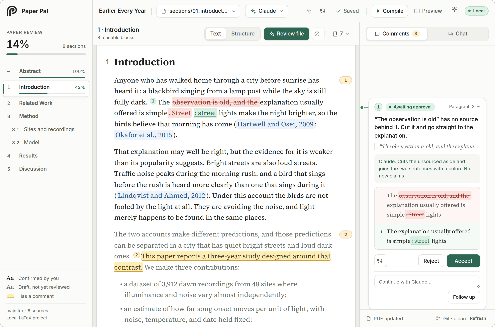
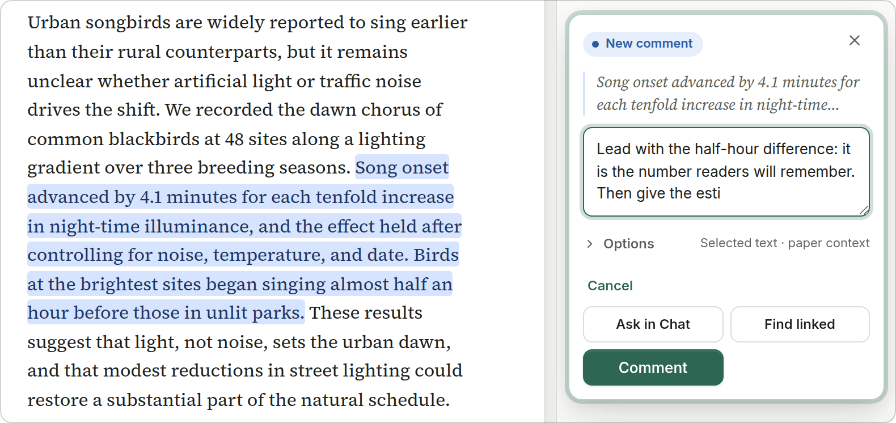
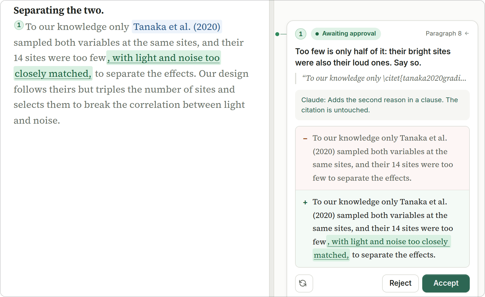
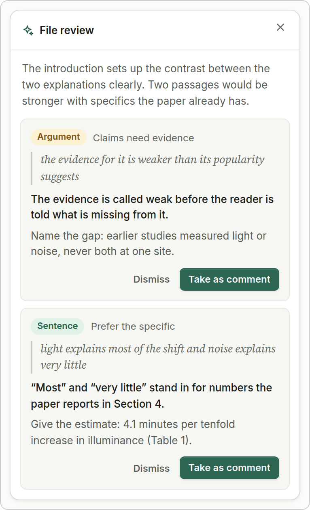
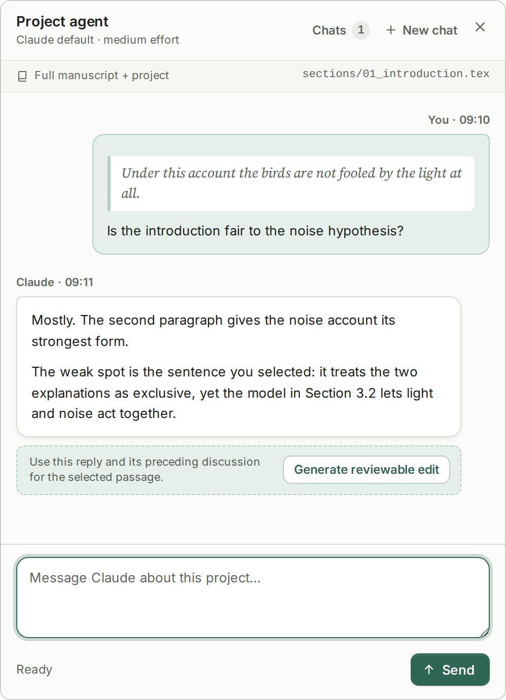
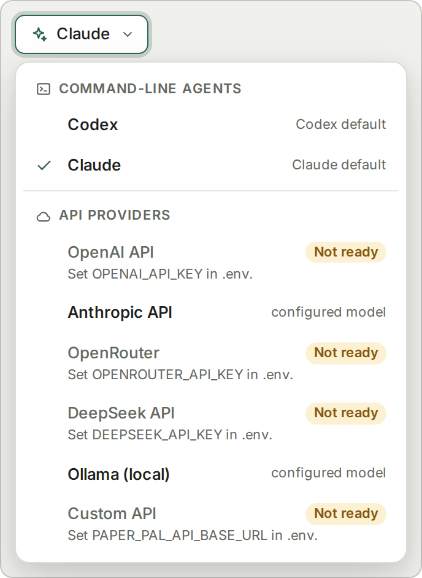
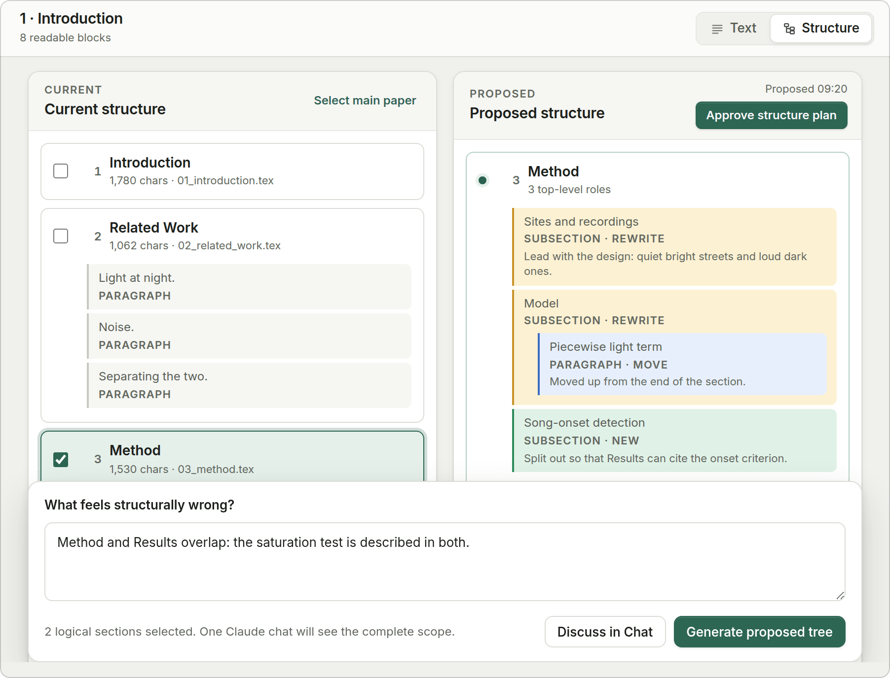

<div align="center">

<p>
<picture>
  <source media="(prefers-color-scheme: dark)" srcset="docs/images/wordmark-dark.svg">
  
</picture>
</p>

**AI 的每一处修改，先过你的眼，再进你的 LaTeX。**

一个在本机运行的论文写作工具。选中一段话写下意见，AI 给出改写，以逐词 diff 的形式呈现；<br>
在你点击 **Accept** 之前，`.tex` 文件一个字都不会被改动。

[](LICENSE)
[](https://github.com/claire1217/paper-pal/actions/workflows/ci.yml)
[](https://nodejs.org)
[](#隐私与安全)

<a href="./README.md">English</a> · <strong>简体中文</strong> &nbsp;|&nbsp; [工作方式](#工作方式) · [快速开始](#快速开始) · [让 AI agent 替你安装](#让你的-ai-agent-替你安装) · [AI 后端](#选择-ai-后端) · [隐私](#隐私与安全) · [常见问题](#常见问题)

</div>

<picture>
  <source media="(prefers-color-scheme: dark)" srcset="docs/images/flow-dark.svg">
  
</picture>

<p align="center"><sub>动画是对应用的示意，截图才是应用本身。其中的论文都是虚构的，随仓库附带于 <a href="examples/sample-paper">examples/sample-paper</a>，运行 <code>npm run demo</code> 即可打开。</sub></p>


## 这是什么

Paper Pal 在浏览器里打开你的 LaTeX 项目，把源码渲染成可读的正文：公式、引用、交叉引用都正常显示。你选中一段文字，说出哪里不对；你已经在用的 AI 给出改写，并以 diff 的形式与原文对照。对 `.tex` 文件的每一次写入，都来自你的一次点击。

<p>
<picture>
  <source media="(prefers-color-scheme: dark)" srcset="docs/images/hero-dark.png">
  
</picture>
</p>

<table>
<tr>
<th width="50%">把段落粘进聊天窗口，或放手让编辑器里的 agent 去改</th>
<th width="50%">Paper Pal</th>
</tr>
<tr>
<td valign="top">

- 把段落贴出去、把回答贴回来，祈祷没有弄丢 `\cite` 和 `\ref`
- 模型顺手改了你根本没提的句子
- 在一堆标记符号的行级 diff 里找到底哪半句变了
- 哪些段落真正检查过，没有任何记录

</td>
<td valign="top">

- 针对具体的词句评论，修改精确映射回对应的源码区间
- 每处改动都是一份红绿逐词 diff，由你接受或拒绝
- 你读的是正文，一切仍以 `.tex` 源文件为准
- 已确认的文字显示为深色，未读的保持灰色，大纲里显示每节的审阅进度

</td>
</tr>
</table>

## 工作方式

**1. 选中并评论。** 可以选两个词，也可以选好几段，然后写下你的要求：这里写紧凑一点、这个结论说得太满、这和第 4 节一致吗？选区会精确对应到源码位置，中间夹着公式、引用和宏也没问题。

<p>
<picture>
  <source media="(prefers-color-scheme: dark)" srcset="docs/images/comment-dark.png">
  
</picture>
</p>

**2. 审 diff。** 修改提议会同时出现在正文里和评论卡片中，并附一句理由。你可以接受、拒绝、重新生成，或者回复一句继续引导它。

<p>
<picture>
  <source media="(prefers-color-scheme: dark)" srcset="docs/images/diff-dark.png">
  
</picture>
</p>

<table>
<tr>
<td width="50%" valign="top">
<p><b>3. 请它审一遍。</b><i>Review file</i> 会像审稿人一样通读当前文件。问题由你筛选，留下的会变成普通评论。</p>
<picture>
  <source media="(prefers-color-scheme: dark)" srcset="docs/images/review-dark.png">
  
</picture>
</td>
<td width="50%" valign="top">
<p><b>4. 就论文提问。</b>聊天可以回答关于整个项目的问题。某条回复可以转成修改提议，但聊天本身从不改动文件。</p>
<picture>
  <source media="(prefers-color-scheme: dark)" srcset="docs/images/chat-dark.png">
  
</picture>
</td>
</tr>
</table>

**5. 读过的就确认，然后编译。** 还没读过的文字是灰色的。选中一段（或整个章节），点 **Confirm**，它就变成黑色，并计入大纲里的审阅进度；接受过的修改提议也算已读。**Compile** 会运行 `latexmk`，并在稿件旁边打开 PDF。

<p>
<picture>
  <source media="(prefers-color-scheme: dark)" srcset="docs/images/confirm-dark.svg">
  
</picture>
</p>

## 快速开始

请克隆到论文仓库之外的任意位置。需要 [Node.js](https://nodejs.org) 20 或更高版本、较新的桌面浏览器，以及 macOS 或 Linux（Windows 见[常见问题](#常见问题)）。`latexmk` 可选：它用于 PDF 面板，并提供 `\ref` 的编号。

```bash
git clone https://github.com/claire1217/paper-pal.git ~/paper-pal && cd ~/paper-pal && npm install
npm run setup -- /path/to/your/paper      # 找到主 .tex 文件，写入 .paper-pal.json
npm start                                 # 然后打开 http://127.0.0.1:4317
```

手边没有论文？`npm run demo -- --open` 会在同一地址打开示例论文的一份临时副本，停止时自动删除。不需要 LaTeX，不需要 AI 后端，也不需要任何 key。

`npm run doctor` 会列出哪些已就绪、哪些还缺，并给出每一项的修复办法。

<details>
<summary>更新、切换论文、卸载</summary>

- **更新：** 在 Paper Pal 目录里运行 `git pull && npm install`。
- **换一篇论文：** 运行一次 `npm run setup -- /path/to/other/paper`，或直接 `npm start -- --repo /path/to/other/paper`。换端口：`npm start -- --port 4400`。
- **卸载：** 删除 Paper Pal 目录即可。每篇论文目录下的 `.paper-pal.json`（设置，不含密钥）和 `.paper-pal/`（你的评论和聊天记录）也可以一并删除。系统其他位置不会留下任何东西。

</details>

## 让你的 AI agent 替你安装

想省事？把下面这段话贴给 Claude Code、Codex、Cursor 或任何编程 agent。setup 全程不提问、输出 JSON、退出码都有文档，服务器还有健康检查接口，所以 agent 可以自己验证安装结果。

```text
Install and set up Paper Pal for my LaTeX paper by following
https://raw.githubusercontent.com/claire1217/paper-pal/main/docs/INSTALL-FOR-AGENTS.md
My paper is at: <你的论文文件夹路径>
Ask me before choosing an AI backend, and never ask me to paste an API key into this chat.
```

<details>
<summary>给 agent 看的：那份指南里有什么</summary>

[docs/INSTALL-FOR-AGENTS.md](docs/INSTALL-FOR-AGENTS.md) 是一份分步操作流程：先问用户什么、前置条件、克隆与安装、用户把 API key 放在哪里（`.env`；绝不放进聊天，也绝不放进项目配置）、`setup --json` 及各退出码的处理方式、`doctor --json`、启动服务器、用 `GET /api/health` 验证，以及向用户汇报的模板。[AGENTS.md](AGENTS.md) 讲的是如何参与本仓库的开发，[llms.txt](llms.txt) 是文档索引。

</details>

## 选择 AI 后端

可以用你已经登录的命令行 agent（包含在你的 Claude 或 ChatGPT 订阅里，不需要 API key），也可以用 API key。每条评论都可以单独选择后端。

<table><tr><td valign="top">

| 后端 | 需要准备 |
|---|---|
| **Claude Code** `claude` | 已登录的 CLI |
| **Codex CLI** `codex` | 已登录的 CLI |
| **OpenAI** `openai` | `OPENAI_API_KEY` + 模型 id |
| **Anthropic** `anthropic` | `ANTHROPIC_API_KEY` + 模型 id |
| **OpenRouter** `openrouter` | `OPENROUTER_API_KEY` + 模型 id |
| **DeepSeek** `deepseek` | `DEEPSEEK_API_KEY` + 模型 id |
| **Ollama** `ollama` | 本机运行的 Ollama + 模型名 |
| **自定义** `custom` | 任何兼容 OpenAI 协议的地址 |

</td>
<td width="300" valign="top">
<picture>
  <source media="(prefers-color-scheme: dark)" srcset="docs/images/backends-dark.png">
  
</picture>
</td>
</tr></table>

> [!NOTE]
> **状态：0.1 版，首次公开发布。** 此前一直是作者自己写论文的日常工具（macOS + Claude Code），这条路径最成熟。其余后端按各厂商文档实现，已通过针对 mock 服务的自动化测试，尚未在真实服务上验证，欢迎反馈。`custom` 可用于 LM Studio、vLLM、Groq 及各类网关。

两个 CLI agent 以只读方式运行在你的论文目录里，评论需要时可以查看你的笔记、数据或代码。API 提供方无法打开文件，所以 Paper Pal 会把当前编辑的文件、你的写作规范文件，以及不超过预算大小的其余稿件内容一并发给它。

密钥只放在一个地方——Paper Pal 目录下被 git 忽略的 `.env`：

```bash
[ -f .env ] || cp .env.example .env   # 然后把 API key 填在 OPENAI_API_KEY= 后面
npm run setup -- /path/to/paper --provider openai --model <model-id> --force
# --force 会覆盖已有的 .paper-pal.json
```

Paper Pal 不内置任何默认模型 id，因为它们很快会过时；请从你的提供方的模型列表里选一个。密钥绝不会从项目配置文件中读取，绝不会传给 CLI agent 或 LaTeX，并且会从运行记录和错误信息中抹去。发给每个后端的具体内容见 [docs/backends.md](docs/backends.md)。

## 隐私与安全

- 服务器只绑定 `127.0.0.1`，校验 `Host` 头以防 DNS rebinding，并拒绝来自其他来源的写请求。不需要账号，没有任何统计或埋点。
- 页面的脚本、样式和字体全部从本机加载。唯一的例外：当你点击 *Load PDF preview* 时，会从被引论文自己的 URL 拉取 PDF。
- 你的文字只会发给你选定的后端，走你自己的账号，适用该提供方的条款。使用 Ollama 时，任何内容都不会离开你的电脑。
- Agent 以只读方式运行。源文件只会因为你自己的编辑、你接受的提议和撤销而改变，并且只限于项目的 `sourceRoot` 之内。
- 评论、聊天和运行记录保存在 `<论文>/.paper-pal/` 中，该目录自带 `.gitignore`，不会被 git 跟踪。`.paper-pal.json` 不含任何密钥，可以放心提交。
- 别人的 LaTeX 在编译时可能执行代码，用不用 Paper Pal 都一样。打开不是你自己写的项目之前，请先读 [SECURITY.md](SECURITY.md)。

## 功能

- **正文视图，面向真实的 LaTeX 项目。** 多文件项目（`\input`、`\include`、`\subfile`、`\import`）、章节、列表、定理、脚注、支持你自定义宏的 KaTeX 公式、natbib 与 biblatex 引用及 `.bib` 预览、来自 `.aux` 文件的 `\ref` 编号。图、表、代码和 TikZ 以只读块显示。
- **精确的源码映射。** 每个块都对应 `.tex` 文件中的一段字符区间。接受一处提议只会替换这段区间，别的一概不动；CRLF 换行和 BOM 原样保留。文件必须是 UTF-8，其他编码一律以只读方式打开。
- **直接编辑**，带自动保存和撤销。如果文件同时在磁盘上被改动（你的编辑器、git、合作者的同步），两边的修改会被合并；有冲突时会来问你。
- **关联修改。** 当一处改写会让别处前后不一致时，agent 可以一并提出那些修改，由你整组确认。
- **审阅进度。** 读完一段或一整节就确认一下，大纲会显示每节完成了多少。
- **结构模式**，用于重组一节：先商定段落计划，再逐段改写。
  <details>
  <summary>截图</summary>
  <br>
  <picture>
    <source media="(prefers-color-scheme: dark)" srcset="docs/images/structure-dark.png">
    
  </picture>
  </details>
- **PDF 面板**，接受修改后用 `latexmk` 重新编译。支持浅色和深色主题。

参考文档（英文）：[配置](docs/configuration.md) · [LaTeX 支持范围与限制](docs/latex-conventions.md) · [后端](docs/backends.md) · [本地 HTTP API](docs/api.md) · [更新日志](CHANGELOG.md)

## 常见问题

<details open>
<summary><b>它会不会把我的源码弄坏？</b></summary>

接受一处提议只会替换一段已映射的区间，其余内容原封不动。测试套件会对一份多文件测试稿件的每一个可编辑块逐一编辑（120 多次），并检查其他内容没有任何变化；还有一个模糊测试，把截断和变异过的文件喂给解析器。即便如此，仍请用 git 管理论文。Paper Pal 从不替你提交，所以 `git diff` 永远能准确告诉你改了什么。
</details>

<details>
<summary><b>这和在 <code>.tex</code> 文件上用 Cursor / Copilot、Overleaf 的 AI 功能，或者直接贴进聊天窗口有什么不同？</b></summary>

编辑器里的 agent 是先写文件，事后给你看一份标记符号的行级 diff。托管的写作助手运行在别人的云上，用的是他们选的模型。聊天窗口对你的文件一无所知。Paper Pal 显示的是正文而不是标记，给的是逐词 diff，在你接受之前什么都不写，在本机运行并使用你自己选的模型，而且记得哪些段落你已经读过。
</details>

<details>
<summary><b>能用来写学位论文吗？</b></summary>

可以，但有一点要注意：`\chapter` 和 `\part` 目前只显示为文字，还不会进入大纲，所以导航是按文件而不是按章。其余功能在书籍规模的项目上都能正常工作。
</details>

<details>
<summary><b>能配合 Overleaf 使用吗？</b></summary>

Paper Pal 处理的是本地文件。借助 Overleaf 的 Git 集成或 GitHub 同步，你可以保留一份本地克隆，在上面运行 Paper Pal，然后推送回去。这两项都是 Overleaf 的付费功能；免费版用户可以下载项目，在本地修改，再把改过的文件传回去。
</details>

<details>
<summary><b>需要安装 LaTeX 吗？</b></summary>

不需要。阅读、评论、diff 和编辑都不依赖它。只有 PDF 面板和 `\ref` 编号（来自 `.aux` 文件）需要 `latexmk`。
</details>

<details>
<summary><b>要花多少钱？</b></summary>

Paper Pal 本身免费。后端费用由提供方按你的账号计费。使用 API 提供方时，一条评论会发送指令、当前编辑的文件，以及默认情况下不超过 `agent.contextBudgetChars`（120,000 字符）的其余稿件。想省一点，可以在评论输入框的选项里选 *Current paragraph only*，或者调低这个预算。Ollama 不花钱。
</details>

<details>
<summary><b>非英文论文呢？</b></summary>

文件必须是 UTF-8。中日韩文稿件可以正常渲染；`agent.reviewLanguage` 用来设置审阅意见使用的语言（`"en"`、`"Chinese"`、`"German"` 等），与稿件本身的语言无关。比如英文论文、中文审阅意见：设为 `"Chinese"` 即可。
</details>

<details>
<summary><b>Windows 呢？</b></summary>

实验性支持，维护者本人未测试。CI 会在 Windows 上跑测试套件，但这些任务即使失败也不会让构建失败。目前更稳妥的选择是 WSL。
</details>

<details>
<summary><b>我的模板渲染得有点怪。</b></summary>

不认识的宏会退化为只显示其参数文字，不常见的环境会退化为只读块，所以最坏的情况应该是“朴素”而不是“坏掉”。如果有内容被隐藏或显示成乱码，请提 issue 并附一个最小复现片段——不要贴你未发表的正文。
</details>

## 路线图

把两个过大的源文件拆成模块、支持 `\chapter`、可编辑的标题块、脚注编号、后端设置界面，以及一个不需要 git 就能安装的打包版本。

## 参与贡献

欢迎提 issue 和 pull request。[CONTRIBUTING.md](CONTRIBUTING.md) 里有开发环境的搭建方法，[AGENTS.md](AGENTS.md) 列出了任何改动都不得破坏的不变量——无论改动出自人还是 agent。请不要在 issue 里粘贴未发表的稿件内容或 API key。

## 致谢与引用

公式由 [KaTeX](https://katex.org) 排版。界面使用 [Inter](https://rsms.me/inter/) 和 [Source Serif 4](https://github.com/adobe-fonts/source-serif)，二者均采用 SIL Open Font License，详见 [THIRD_PARTY.md](THIRD_PARTY.md)。如果 Paper Pal 对你的论文有帮助，欢迎提及：[CITATION.cff](CITATION.cff) 为 GitHub 的 "Cite this repository" 按钮提供引用信息。

## 许可证

[MIT](LICENSE)
